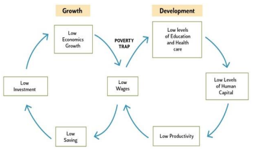

## 1. What is Poverty

* Poverty has been traditionally defined in **economic terms** — focusing on **income, property, and living standards**.
* A person is considered **poor** when their **income is insufficient** to meet **basic needs**: **food, shelter, and clothing**.

---

## Poverty and Its Status in India

---

## What is Poverty?

* **Poverty**: Lack of resources to meet **basic needs** — food, shelter, clothing, healthcare, and education.
* **World Bank Definition**:
  ➔ Poverty is **hunger**, **lack of shelter**, **illness without treatment**, **lack of education**, **unemployment**, **fear for the future**, **loss due to unclean water**, **powerlessness**, and **lack of freedom**.

---

## Status of Poverty in India

### Incidence of Poverty (Historical Trends):

| Year | Poverty Rate |
| :--: | :----------: |
| 1947 |      80%     |
| 1973 |      55%     |
| 1993 |      36%     |
| 2011 |     21.9%    |

---

### Multidimensional Poverty:

* **NITI Aayog MPI Report (2021)**:
  ➔ **25.01%** of India's population is multidimensionally poor.

* **Global MPI 2022**:
  ➔ **415 million** people escaped multidimensional poverty (2005–06 to 2019–21).
  ➔ Poverty incidence dropped from **55.1%** to **16.4%**.

* **Vulnerability**:
  ➔ **18.7%** (approx. 260.9 million people, 2020) classified as **vulnerable to multidimensional poverty**.

---

### Intensity of Poverty:

* **World Bank (2019)**:
  ➔ Number of extremely poor decreased by **12.3%** between **2011 and 2019**.

---

### Regional Variations:

| High Poverty States | Poverty Rate | Low Poverty States | Poverty Rate |
| :------------------ | :----------- | :----------------- | :----------- |
| Bihar               | 51.91%       | Kerala             | 0.71%        |
| Jharkhand           | 42.16%       | Goa                | 3.76%        |
| Uttar Pradesh       | 37.79%       | Sikkim             | 3.82%        |
| Madhya Pradesh      | 36.65%       | Tamil Nadu         | 4.89%        |
| Meghalaya           | 32.67%       | Punjab             | 5.59%        |

---

## Beyond Income: A Multidimensional View

* Modern perspectives view poverty as a **complex, multidimensional phenomenon** involving **sociological, political, psychological, and geographical** factors.
* Income is just one aspect; poverty also results from **limited access to education, healthcare, and social networks**, restricting full human potential.

---

## Measuring Poverty: Different Approaches

### • Absolute Poverty

* Defines a **fixed minimum income level** (poverty line) necessary to meet **basic needs**.
* Indicators include **calorie intake**, **housing quality**, and **access to healthcare**.

### • Relative Poverty

* Defines poverty **in relation to societal living standards**, where the poverty line **shifts** based on **societal norms and expectations**.
* Example: Someone poor in the **United States** might not be classified as poor in **India**, due to differing living standards.

---

## 2. Poverty Line

* The poverty line defines the **minimum income, consumption, or access to goods/services** required to be considered non-poor.
* It is calculated based on **expenditure** needed for an **adequate diet, clothing, and shelter**.
* In India, emphasis is laid on the **cost of food** meeting **minimum calorie requirements**.
* **World Bank's International Poverty Line (IPL)** was updated to **\$1.90 per day in 2015**.

---

## 2.1 Evolution of Poverty Estimation in India

### • Lakdawala Expert Group (1993)

* Recommended **state-specific poverty lines** using **different Consumer Price Indices** (CPI) for industrial and agricultural workers to account for regional variations.

### • Tendulkar Expert Group (2009)

* Shifted methodology from **calorie intake norms** to **broader nutritional outcomes**.
* Introduced a **uniform all-India poverty line**.
* Included **private expenditure** on **health** and **education**.

### • Rangarajan Committee (2014)

* Proposed **separate rural and urban poverty baskets**.
* Included detailed **food and non-food items** to reflect diverse consumption needs.

### • NITI Aayog Task Force (2015)

* Recommended **tracking the bottom 30% population**, not just those officially below the poverty line.
* Suggested monitoring **material deprivation** in areas like **nutrition**, **housing**, and **connectivity**.

---

## Challenges in Establishing a Poverty Line

* **Cost of Basic Needs**: Complex due to **regional differences**, **inflation**, and **changing consumption patterns**.
* **Calorie Intake vs. Nutritional Outcomes**:

  * Earlier methods emphasized **minimum calories**;
  * Modern approaches focus on **overall nutritional health** to ensure better living standards.

---

## 2.2 National MPI by NITI Aayog

* **NITI Aayog** developed the **National MPI**, modeled on the **Global MPI**.
* Retains **10 original indicators** + adds **Maternal Health** and **Bank Account** (aligned with India's national priorities).
* Purpose:

  * **Targeted, inclusive poverty interventions**.
  * **Identification of overlapping deprivations**.
  * **Inclusive policy formulation**.

---

## Structure of MPI

### ➔ Three Dimensions:

* **Health**
* **Education**
* **Living Standards**

### ➔ Ten Global Indicators:

* **Health**: Nutrition, Child Mortality
* **Education**: Years of Schooling, School Attendance
* **Living Standards**: Cooking Fuel, Sanitation, Drinking Water, Electricity, Housing (Floor), Assets

*(India’s National MPI adds: **Maternal Health** and **Bank Account**)*

---

## Key Findings (NITI Aayog Report 2023)

* **14.96%** of India's population suffers from **multidimensional poverty**.
* India among **25 nations** to **halve MPI** within **15 years**.
* **415 million** people moved out of poverty (2005/06 to 2019/21).
* **Incidence of poverty** reduced from **55.1%** to **16.4%**.
* **Deprivation** levels declined across all indicators.

---

## Global MPI Context

* **Global MPI** assesses **acute multidimensional poverty** across **110+ developing countries**.

---

## Challenges in NMPI

* **Low Sensitivity**: Threshold (deprived in ≥1/3 indicators) may miss smaller deprivations.
* **COVID-19 Impact**: Might not fully capture pandemic's effects on health and livelihood.
* **Stagnant Wages**: Questions consistency of poverty reduction despite stagnant real incomes.

---

## Way Forward

* **Expand Dimensions**: Add learning outcomes, social discrimination, environmental factors.
* **Update Data**: Use recent **NSS** and **NFHS** surveys.
* **Effective Monitoring**: Real-time tracking of deprivation indicators.
* **Social Audits** and **Awareness Campaigns**: Strengthen poverty alleviation programs.

---

## 2.3 Socio-Economic Caste Census (SECC)

* **State governments** are responsible for identifying poor households using **Below Poverty Line (BPL) censuses**.
* The **latest comprehensive data** available is from the **Socio-Economic Caste Census (SECC) 2011**.

---

## Significance of SECC

* **Identification of Poor Households**:
  ➔ SECC data is crucial for **effective targeting** of beneficiaries under **poverty alleviation programs**.

* **Multidimensional Approach**:
  ➔ SECC goes beyond **income criteria**, considering **housing conditions**, **education levels**, and **basic amenities** to assess deprivation.

---

## Distinct Characteristics of Poverty in India 

---

## 1. Rural-Urban Divide

* **Rural areas** are more impoverished than urban areas.
* **Poverty ratio**:
  ➔ **32.75%** rural vs **8.81%** urban (*NITI Aayog MPI, 2021*).
* Rural population largely dependent on **low-productivity agriculture**.

---

## 2. Unequal Distribution of Wealth

* **5%** of the population owns **over 60%** of the wealth.
  (*Oxfam Report, 2022*)

---

## 3. Lack of Education

* Literacy rates are **lower in rural areas**.
* **Illiteracy** leads to **limited job opportunities** and **low wages**, perpetuating poverty.

---

## 4. Health Problems

* Poverty linked to **malnutrition**, **high infant mortality**, and **prevalence of diseases** like **tuberculosis**.

---

## 5. Caste System

* Lower castes face **discrimination** and **limited opportunities**.
* **Scheduled Castes** constitute **almost one-fourth** of India’s multidimensionally poor.
  (*Global MPI, 2021*)

---

## 6. Gender Inequality

* Women face **discrimination** in **education**, **employment**, and **healthcare**, deepening **female poverty**.

---

## 7. Informal Economy

* Majority of workforce in **informal sector**:
  ➔ Leads to **low wages**, **poor working conditions**, and **lack of social protections**.

---

## Factors Contributing to Poverty in India 

---

## 1. Population Explosion

* Rapid population growth **stretches limited resources**, depriving people of **basic necessities**.

---

## 2. Lack of Agricultural Productivity

* **Fragmented land holdings**, **traditional farming methods**, and **obsolete technology** lead to **low agricultural productivity**, reducing rural incomes.

---

## 3. Lack of Education

* **Illiteracy** creates a **vicious cycle of poverty**, limiting access to better jobs and basic necessities.

---

## 4. Lack of Employment Opportunities

* **Job creation** hasn't kept pace with **population growth**.
* **Low skilling** further compounds **unemployment and underemployment**.

---

## 5. Inadequate WASH (Water, Sanitation, and Hygiene) Facilities

* Rural areas, urban slums, and disaster-prone zones **lack basic WASH infrastructure**, deepening vulnerability to poverty.

---

## 6. Climate Change

* Poor are **disproportionately impacted** due to lack of information, resources, and resilience to climate shocks.

---

## 7. Social Factors

* **Caste and class dynamics**, and traditional societal structures make certain sections **more vulnerable to persistent poverty**.

---

## 8. Low Per Capita Income

* India’s **low per capita income** results in many surviving on **less than \$2/day**, pushing a large section into poverty.

---

## 3. Causes of Poverty

---

## 3.1 Nexus Between Inequality and Poverty

* **Inequality and poverty** reinforce each other in a **vicious cycle**.

* **Unequal Distribution of Resources**:
  ➔ Top **1%** of India owns **over 25%** of national wealth.
  ➔ Large population struggles for **basic needs**, limiting upward mobility.

* **Limited Social Safety Nets**:
  ➔ As per **World Bank 2021**, only **25%** of Indians benefit from **social security**.
  ➔ Lack of safety nets exposes the poor to **economic shocks**.

---

## Manifestations of Inequality - The visible ways poverty shows up and impacts people's lives across different areas like region, caste, gender, or rural settings.

### • Ruralization of Poverty

* **Causes**:

  * Limited access to **education**, **healthcare**, **infrastructure**.
  * High dependence on **vulnerable agriculture**.
  * **Gendered land ownership** disadvantaging women.

* **Impact**:

  * Rural poverty affects **marginalized communities** (tribals, lower castes).
  * Restricts **social mobility**, perpetuating poverty.

---

### • Regional Variations

* **Poverty Levels**:

  * Higher in **Bihar, Jharkhand, Chhattisgarh**.
  * Lower in **Kerala, Goa**.
    (*Tendulkar Committee Report 2011*)

* **Causes**:

  * Historical disadvantages, low **infrastructure investment**, **geographical constraints** (droughts, floods).

* **Impact**:

  * Creates **economic disparity** among states.
  * Calls for **targeted policies** and **resource allocation**.

---

### • Caste and Religion Intersection

* **Findings**:

  * **SCs and STs** show **higher poverty rates** than upper castes.
    (*National Socioeconomic Survey 2011*)

* **Causes**:

  * Historical relegation to **low-wage jobs**.
  * **Discrimination** in education, employment, and land access.

* **Impact**:

  * **Socio-economic marginalization** continues across generations.

---

### • Feminization of Poverty

* **Definition**: Increasing share of **women among the poor** due to **systemic gender inequality**.

* **Key Indicators**:

  * **Wage Gap**: Women earn **34% less** than men.
  * **Labour Force Participation**: Only **27%** of women are employed.
  * **GDP Contribution**: Women contribute just **17%**.
  * **Unpaid Care Work**: Women spend more time on **unpaid domestic work**.
  * **Education Disparity**: Girls face **limited access to education**.

* **Impact**:

  * Economic vulnerability, educational disadvantages, limited paid employment opportunities.
  * Increased health, safety risks; social norms and violence further restrict advancement.

---

## 3.2 Vicious Circle Theory

* Poverty traps individuals in circumstances that make escaping poverty difficult.

---

### Causes:

* **Low Levels of Education**:
  ➔ Poverty limits access to quality education.
  ➔ Children often attend **under-resourced schools** with a **student-teacher ratio of 60:1** (*UNESCO Institute for Statistics, 2021*), restricting skill development for better employment.

* **Poor Health and Malnutrition**:
  ➔ Chronic malnutrition among **tribal children in Madhya Pradesh** linked to **low school enrollment** and **limited future opportunities** (*Centre for Chronic Poverty Studies, 2019*).
  ➔ Highlights **intergenerational transmission** of poverty.

* **High Fertility Rates**:
  ➔ India's **Total Fertility Rate (TFR)** = **2.0**, but higher in poverty-ridden states (*Population Reference Bureau, 2021*).
  ➔ High fertility strains family resources, limiting investment in each child's **education and well-being**, sustaining poverty across generations.

---

## 3.3 Geographical Factors

* Poverty can arise due to **geographical conditions** like **resource scarcity** in **desert** and **hill areas**, making economic development difficult.

---

### Causes:

* **Regional Disparity**:
  ➔ Poverty is uneven across India.
  ➔ **Bihar**: **51.9% poverty rate**, **Goa**: **5.1%** (*SECC 2011*).

* **Natural Disasters**:
  ➔ India faces frequent **floods, droughts, cyclones**.
  ➔ **2.4 million** people pushed into poverty annually due to disasters (*World Bank Report, 2020*).

* **Climate Change Impact**:
  ➔ Climate change could push an additional **36 million Indians into poverty by 2030** (*International Food Policy Research Institute, 2022*).

---

## 4. Consequences of Poverty

* Poverty impacts **individuals, families, and society**, creating a **vicious cycle** that is hard to escape.

---

### Key Social Consequences:

* **Culture of Poverty**:
  ➔ Poverty becomes **ingrained across generations**.
  ➔ Limited access to **education**, **employment**, and **housing** leads to **hopelessness** and discourages initiative.

* **Effects on Health**:
  ➔ Poor living conditions, malnutrition, and lack of healthcare raise **infant mortality**, **disease vulnerability**, and **mental health issues**.
  ➔ *WHO Report 2020*:

  * People in the **lowest income quintile live 18 fewer years** than richest.

* **Stolen Childhoods**:
  ➔ *UNICEF 2021 Report*:

  * **606 million children** live in extreme poverty.

  * **Limited Education**:
    ➔ Poor schooling infrastructure hampers children's academic growth.

  * **Child Labor**:
    ➔ Poverty forces children into work, sacrificing education.

  * **Early Marriage**:
    ➔ Poor girls are **2.5 times more likely** to marry young, harming education and health.

* **Social Exclusion and Stigma**:
  ➔ Poverty leads to **ostracization**, limits **community participation**, and deepens **marginalization**.

* **Psychological Effects**:
  ➔ Continuous struggle causes **low self-esteem**, **hopelessness**, **stress**, and **anxiety**.

---

### Urban and Rural Poverty – A Contrast

---

## Urban Poverty

### Causes:

* **Migration** from rural areas leads to overcrowded cities.
* **Exclusionary urbanization** marginalizes informal settlements.
* **Inadequate basic services**: Water, sanitation, healthcare lacking.
* **Regional disparity**: Overpopulation in megacities due to **underdeveloped smaller cities**.
* **Financial insecurity**: Prevalence of **informal employment** and **underemployment**.
* **Inaccessibility to social security**: Lack of residency proof excludes many from welfare benefits.

---

## Rural Poverty

### Causes:

* **Land fragmentation**: Reduces agricultural productivity.
* **Lack of diversification**: Overdependence on agriculture.
* **Monsoon dependency**: Incomes fluctuate heavily.
* **Debt cycle**: Reliance on **high-interest informal credit**.
* **Inadequate access to services**: Poor healthcare, education, and social protection.

---

## Way Forward

### For Urban Poverty:

* **Decentralized decision-making**: Empower local governance.
* **Regional development**: Incentivize growth in smaller towns.
* **Sustainable livelihoods**: Promote **labor-intensive industries**.
* **Portability of social security**: Enable access across regions.

---

### For Rural Poverty:

* **Increase productivity and market access**: Modern farming, irrigation.
* **Efficient value chains**: Reduce post-harvest losses.
* **Job creation**: Especially for **rural youth**.
* **Economic diversification**: Boost **non-agricultural activities**.
* **Investing in people and skills**: Vocational training.
* **Rural infrastructure development**: Roads, electricity, healthcare.

---

## 5. Schemes and Policies to Alleviate Poverty in India 

---

## India’s SDG Goal 1 Targets (2030)

* **Baseline**:

  * **21.9%** population BPL (2011);
  * Target: Reduce **by half** ➔ **\~10.95%**.
* **Homeless households**:
  ➔ Current: \~11 per 10,000 households ➔ Target: **0** homeless.
* **Health Insurance Coverage**:
  ➔ Current: **29%** ➔ Target: **100%** households.
* **Social Protection**:

  * **MNREGA jobs**: 85% eligible coverage ➔ Target: **100%**.
  * **Maternity benefits**: 36% coverage ➔ Target: **100%**.

---

## Strategies to Alleviate Poverty

### 1. Livelihood Generation

* **Integrated Rural Development Programme (IRDP) (1978)**:
  ➔ Subsidies + bank loans to create **sustainable rural incomes**.

* **National Rural Livelihood Mission (NRLM) – Aajeevika (2011)**:
  ➔ Promotes **Skill development** and **Self-Help Groups (SHGs)** for income diversification.

* **National Urban Livelihood Mission (NULM) (2013)**:
  ➔ Supports **urban poor** through SHGs, skill training, and credit access for **self-employment**.

---

### 2. Food Security and Employment

* **Food for Work Programme (2000)**:
  ➔ Wages paid via **food grains** for rural employment projects.

* **Mahatma Gandhi National Rural Employment Guarantee Act (MGNREGA) (2005)**:
  ➔ Guarantees **100 days paid work** annually in rural areas, emphasizing **women's participation**.

* **National Food Security Mission (2007)**:
  ➔ Enhances **agricultural production**, **farm jobs**, and **farm incomes**.

---

### 3. Social Security and Financial Inclusion

* **National Social Assistance Programme (NSAP)**:
  ➔ Provides **old age pensions**, **maternity benefits**, and other social security measures.

* **Pradhan Mantri Jan Dhan Yojana (PMJDY)**:
  ➔ Promotes **financial inclusion** by opening **bank accounts** for the unbanked poor and enabling **direct benefit transfers**.

---

## Way Forward to Tackle Poverty in India 

---

## 1. Invest in Social Sectors: Empower the Underprivileged

* **Expand Quality Education**:
  ➔ Focus on **girls' education** through schemes like **Beti Bachao Beti Padhao**.
  ➔ *World Bank Report (2018)*: Every additional schooling year ➔ **10% higher earnings**.

* **Improve Sanitation**:
  ➔ Scale up **Swachh Bharat Abhiyan** to improve **rural sanitation and hygiene**.

---

## 2. Foster Inclusive Growth: Create Opportunities for All

* **Skill Development**:
  ➔ Strengthen **Skill India** initiatives to bridge **skill gaps**.

* **Fair Wages and Social Protection**:
  ➔ Strengthen **minimum wage regulations**.
  ➔ Expand **social safety nets** for **informal workers**.

---

## 3. Build Climate Resilience

* **Climate-Smart Agriculture**:
  ➔ Promote **drought-resistant crops** and **efficient irrigation** systems to tackle climate shocks.

---

## 4. Strengthen Social Safety Nets

* **Enhance Food Security**:
  ➔ Expand and reform **Public Distribution System (PDS)** using **technology** for better targeting.

---

# Universal Basic Income (UBI): A Potential Approach

---

## Arguments **For UBI**

* **Income Security**:
  ➔ Guarantees **minimum income** for all citizens.

  ➔ *SEWA Pilot Project (Madhya Pradesh, 2011–13)*:

  * UBI led to **better nutrition**, **health**, **school attendance**, **economic activity**.

* **Empowerment**:
  ➔ Increases **individual financial freedom**.
  ➔ *Kenya UBI experiment*: Boosted **livestock investment, farming, local economy**.

* **Simplification of Welfare Systems**:
  ➔ Reduces **administrative costs** and **bureaucratic hurdles**.

---

## Arguments **Against UBI**

* **Fiscal Sustainability**:
  ➔ **Huge financial cost**; may divert funds from proven targeted programs.

* **Inflation & Disincentive to Work**:
  ➔ Risk of **price rise** and reduced **work incentives**.
  ➔ *Finland UBI Experiment*:

  * Showed **improved well-being** without major reduction in job-seeking.

* **Targeting and Efficiency**:
  ➔ **Universal approach** might dilute benefits for **most vulnerable**.
  ➔ **Regional cost variations** complicate uniform UBI implementation.

---

## Final View

* UBI is a **supportive tool**, not a **standalone solution**.
* Focus must also remain on:

  * **Empowering underprivileged**,
  * **Inclusive growth**,
  * **Climate resilience**,
  * **Stronger safety nets**.

---

Alright bro,
sticking to your solid format 🔥 —
**short, crisp, slightly descriptive**, **only from your input**, clean and UPSC-ready.

Here’s your extracted version:

---

## Developmental Issues Arising Due to Poverty in India

---

## 1. Poor Health Outcomes

* Poverty limits access to **healthcare**, **clean water**, and **sanitation**.
* **Example**: India has the **highest number of stunted children**, accounting for **one-third of global total**. (*Global Nutrition Report 2020*)

---

## 2. Limited Access to Education

* Poor families often **withdraw children from school** for work, perpetuating **intergenerational poverty**.
* Girls and women are particularly affected.

---

## 3. High Infant Mortality Rates

* Poverty leads to **inadequate nutrition and healthcare** for infants.
* **Example**: **Infant Mortality Rate (IMR)** in India is **35.2** (*NFHS-5, 2019–21*).

---

## 4. Social Exclusion

* Poor households face **marginalization** and reduced participation in **economic and social activities**.

---

## 5. Increased Crime Rates

* Poverty forces some individuals towards **criminal activities** for survival.

---

## 6. Inadequate Housing and Sanitation

* Lack of access to **basic amenities** like clean water and sanitation leads to **health problems** such as **diarrhea** and **water-borne diseases**.

---

## 7. Gender Inequality

* Women face **disproportionate poverty impact**:

  * Denied **education**, **early marriages**,
  * Trapped in **low-paid, insecure jobs**.

---

## 8. Environmental Degradation

* Poverty drives **unsustainable practices** (e.g., **deforestation**, **overuse of natural resources**), worsening environmental health.

---

## 9. Internal Migration

* Poverty causes **rural-urban migration**:

  * Growth of **informal sector**,
  * Expansion of **urban slums**.

---

## Relationship Between Poverty and Demography in India 

---

## Demographic Change Leading to Poverty

* **Rapid Population Growth** ➔

  * **Increased competition** for limited resources ➔ poverty and inequality.
  * **Pressure on infrastructure**: housing, sanitation, healthcare.
  * **Higher unemployment rates**: jobs can't keep pace with growing population.

---

## Poverty Leading to Demographic Change

* **Lack of access to family planning** ➔ High fertility rates and faster population growth.
* **Lack of education and opportunities** ➔ Limits informed family planning choices.
* **Cultural and social norms** ➔ Preference for **large families** sustains high population growth.

---

## Measures to Alleviate Poverty in India

---

## 1. Investing in Education

* Expand access to **education and vocational training** to equip individuals with **skills** for better-paying jobs.

---

## 2. Promoting Economic Growth

* Foster **entrepreneurship**, **innovation**, and **investment** to create **new job opportunities**.

---

## 3. Providing Access to Basic Services

* Ensure **healthcare**, **clean water**, **sanitation**, and **electricity**, especially in **rural areas**, to improve health and quality of life.

---

## 4. Proper Implementation of Social Protection Programs

* Implement **cash transfers**, **food subsidies**, and **PDS programs** with **accountability** and **transparency** to protect vulnerable groups.

---

## 5. Promoting Gender Equality

* Break barriers for **women in education, healthcare, and employment**, empowering them to lift families out of poverty.

---

## 6. Strengthening Agricultural Productivity

* Enhance **rural incomes** by improving **agricultural techniques** and **farm productivity**.

---

## 7. Addressing Income Inequality

* Use **progressive taxation** and **redistributive policies** to bridge the wealth gap and promote **social cohesion**.

---

## 8. Encouraging Inclusive Growth

* Ensure **economic growth** benefits **all sections of society**, promoting **sustainable development** and **poverty reduction**.

---

