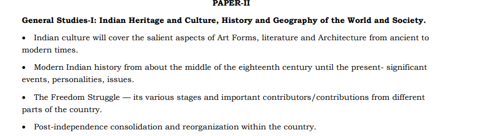
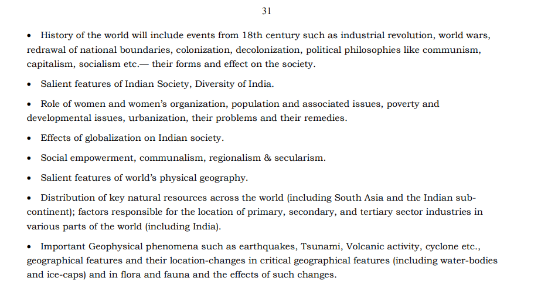

General Studies-I: Indian Heritage and Culture, History and Geography of the World and Society.

- Indian culture will cover the salient aspects of Art Forms, literature and Architecture from ancient to
modern times.

- Modern Indian history from about the middle of the eighteenth century until the present- significant
events, personalities, issues.

- The Freedom Struggle — its various stages and important contributors/contributions from different
parts of the country.

- Post-independence consolidation and reorganization within the country.

- History of the world will include events from 18th century such as industrial revolution, world wars,
redrawal of national boundaries, colonization, decolonization, political philosophies like communism,
capitalism, socialism etc.— their forms and effect on the society.

- Salient features of Indian Society, Diversity of India.

- Role of women and women’s organization, population and associated issues, poverty and
developmental issues, urbanization, their problems and their remedies.

- Effects of globalization on Indian society.

- Social empowerment, communalism, regionalism & secularism.

- Salient features of world’s physical geography.

- Distribution of key natural resources across the world (including South Asia and the Indian subcontinent); factors responsible for the location of primary, secondary, and tertiary sector industries in
various parts of the world (including India).

- Important Geophysical phenomena such as earthquakes, Tsunami, Volcanic activity, cyclone etc.,

- geographical features and their location-changes in critical geographical features (including water-bodies
and ice-caps) and in flora and fauna and the effects of such changes. 

